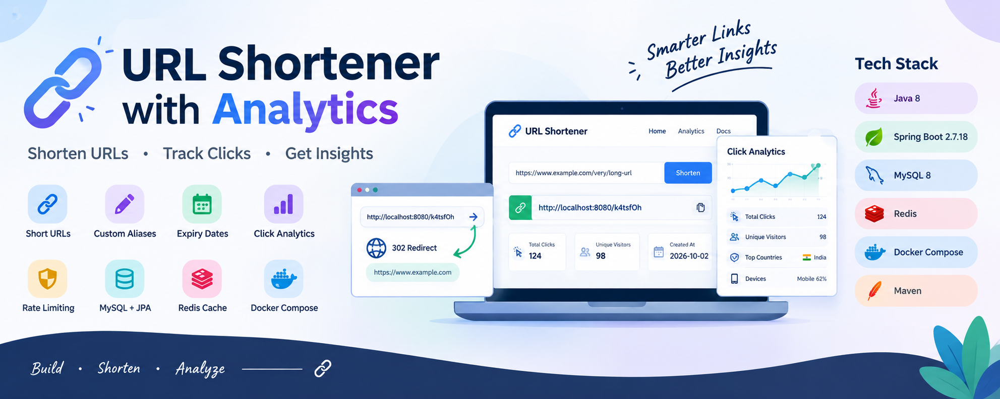

# URL Shortener with Analytics

<p align="center">
  <a href="https://url-shortener-production-4493.up.railway.app/swagger-ui/index.html">
    
  </a>
  <a href="https://url-shortener-production-4493.up.railway.app">
    
  </a>
</p>

<p align="center">
  
</p>

A backend-focused URL Shortener built with **Java 8, Spring Boot 2.7.18, MySQL 8, Redis, Maven, and Docker Compose**.

The project provides REST APIs for creating short URLs, custom aliases, expiry dates, redirects, click tracking, analytics, rate limiting, Swagger/OpenAPI documentation, and scheduled cleanup of expired links.

> **Current implementation note:** Redis is used for distributed rate limiting and Redis infrastructure is included in the project. Spring Cache-based URL mapping caching is currently disabled on the redirect lookup path to avoid serialization/type-mapping issues with cached `UrlMapping` objects.

---

## 🚀 Live Demo

**Live API:**  
https://url-shortener-production-4493.up.railway.app

**Swagger UI:**  
https://url-shortener-production-4493.up.railway.app/swagger-ui/index.html

**Example Short URL:**  
https://url-shortener-production-4493.up.railway.app/UZ4MgxF

## Features

- Create short URLs from long URLs
- Generate unique Base62 short codes
- Create custom aliases
- Validate custom aliases and prevent duplicates
- Optional URL expiry dates
- Redirect short URLs using HTTP `302`
- Track redirect click counts
- View URL details and analytics
- Record recent click information asynchronously
- Redis-backed distributed rate limiting
- Automatic cleanup of expired URL records
- MySQL persistence using Spring Data JPA
- Database versioning with Flyway
- Swagger/OpenAPI 3 documentation
- Spring Boot Actuator support
- Docker and Docker Compose support
- Optional MaxMind GeoIP2 integration for location-related click information

---

## ☁️ Deployment

- **Platform:** Railway
- **Application:** Spring Boot
- **Database:** MySQL
- **Containerization:** Docker
- **Public API:** https://url-shortener-production-4493.up.railway.app

## Tech Stack

### Backend
- Java 8
- Spring Boot 2.7.18
- Spring Web
- Spring Data JPA
- Hibernate
- Maven

### Database
- MySQL 8
- Flyway migrations

### Caching / Rate Limiting
- Redis
- Lettuce
- Jedis
- Bucket4j

### Documentation
- Swagger / OpenAPI 3
- Springdoc OpenAPI

### Other
- Docker
- Docker Compose
- Spring Boot Actuator
- Yauaa for User-Agent parsing
- MaxMind GeoIP2 for optional GeoIP support

---

## Project Architecture

```text
Client
  |
  | HTTP Request
  v
Spring Boot Application
  |
  +--------------------+
  |                    |
  v                    v
REST Controllers     Rate Limiting
  |                    |
  v                    v
Service Layer        Redis
  |
  +--------------------+
  |                    |
  v                    v
MySQL / JPA        Click Tracking
  |
  v
Flyway Migrations
```

---

## Main API Endpoints

| Method | Endpoint | Description |
|---|---|---|
| POST | `/api/urls` | Create a short URL |
| GET | `/{shortCode}` | Redirect to the original URL |
| GET | `/api/urls/{shortCode}` | Get URL details and click count |
| GET | `/api/analytics/{shortCode}` | View click analytics |
| DELETE | `/api/urls/{shortCode}` | Delete a short URL |

### 1. Create Short URL

**POST**

```text
/api/urls
```

Example request:

```json
{
  "url": "https://github.com"
}
```

Example response:

```json
{
  "shortCode": "k4tsfOh",
  "shortUrl": "http://localhost:8080/k4tsfOh",
  "longUrl": "https://github.com",
  "createdAt": "2026-10-02T10:08:54.097Z",
  "expiresAt": null,
  "clickCount": 0,
  "customAlias": false
}
```

---

### 2. Create a Custom Alias

A custom alias can be supplied when creating a short URL.

Example:

```json
{
  "url": "https://www.google.com",
  "customAlias": "mygoogle"
}
```

The resulting short URL is:

```text
http://localhost:8080/mygoogle
```

---

### 3. Redirect Short URL

**GET**

```text
/{shortCode}
```

Example:

```text
GET /mygoogle
```

The application returns an HTTP `302` redirect to the original URL.

Example:

```text
HTTP/1.1 302
Location: https://www.google.com
```

---

### 4. Get URL Details

**GET**

```text
/api/urls/{shortCode}
```

Example:

```text
GET /api/urls/mygoogle
```

Example response:

```json
{
  "shortCode": "mygoogle",
  "shortUrl": "http://localhost:8080/mygoogle",
  "longUrl": "https://www.google.com",
  "createdAt": "2026-10-02T09:20:04.882Z",
  "expiresAt": null,
  "clickCount": 3,
  "customAlias": true
}
```

---

### 5. Get Analytics

**GET**

```text
/api/analytics/{shortCode}
```

This endpoint provides analytics and recent click information for a short URL.

Analytics can include information such as:

- Total clicks
- Recent clicks
- Timestamp information
- User-Agent information
- Referrer information
- IP-related information when available
- Optional GeoIP information when GeoIP is configured

---

### 6. Delete a Short URL

**DELETE**

```text
/api/urls/{shortCode}
```

Example:

```text
DELETE /api/urls/mygoogle
```

The URL mapping is removed from the database.

---

## Swagger / OpenAPI

Swagger UI is available when the application is running:

```text
http://localhost:8080/swagger-ui/index.html
```

OpenAPI JSON:

```text
http://localhost:8080/v3/api-docs
```

Swagger provides an interactive way to test the available REST APIs.

Current documented endpoints include:

```text
POST   /api/urls
GET    /api/urls/{shortCode}
GET    /api/analytics/{shortCode}
DELETE /api/urls/{shortCode}
GET    /{shortCode}
```

---

## Running the Project with Docker Compose

### Prerequisites

Install:

- Docker Desktop
- Git

Docker Compose is included with current Docker Desktop installations.

---

### Start the Application

From the project root:

```bash
docker compose up --build
```

This starts:

- Spring Boot application
- MySQL
- Redis

---

### Services

| Service | Host Port | Container Port |
|---|---:|---:|
| Spring Boot App | 8080 | 8080 |
| MySQL | 3307 | 3306 |
| Redis | 6379 | 6379 |

The MySQL container uses port `3306` internally, while the host exposes it on `3307`.

---

### Run in Detached Mode

```bash
docker compose up -d --build
```

---

### Check Running Containers

```bash
docker compose ps
```

---

### View Application Logs

```bash
docker compose logs -f app
```

---

### Stop the Application

```bash
docker compose down
```

---

### Stop and Remove Volumes

Use this when you want to reset the local database data:

```bash
docker compose down -v
```

---

## Local API Testing

### Create a Short URL

PowerShell:

```powershell
Invoke-RestMethod -Uri "http://localhost:8080/api/urls" -Method Post -ContentType "application/json" -Body '{"url":"https://github.com"}'
```

---

### Test Redirect

PowerShell:

```powershell
curl.exe -i http://localhost:8080/k4tsfOh
```

Expected result:

```text
HTTP/1.1 302
Location: https://github.com
```

Replace `k4tsfOh` with the short code generated by your application.

---

### Check URL Details

```powershell
Invoke-RestMethod -Uri "http://localhost:8080/api/urls/k4tsfOh"
```

---

## Database

The application uses **MySQL 8** for persistent URL and click-related data.

JPA is used for database access and Flyway manages database migrations.

The application connects to the MySQL container through the Docker Compose network.

---

## Redis

Redis is included in the application infrastructure.

The current implementation uses Redis primarily for:

- Distributed rate limiting
- Bucket4j state storage

Redis is running as a separate Docker Compose service.

### Important implementation note

The redirect lookup method currently reads the `UrlMapping` directly from MySQL rather than using Spring's `@Cacheable` URL-mapping cache.

This was intentionally changed after encountering a Redis deserialization/type-mapping problem where cached objects were returned as `LinkedHashMap` instances instead of `UrlMapping` objects.

The application therefore prioritizes reliable redirect behavior over the previous object-cache implementation.

---

## Rate Limiting

The application uses **Bucket4j with Redis** for distributed rate limiting.

This helps control excessive API traffic and provides a rate-limiting mechanism that can work across multiple application instances when Redis is shared.

---

## URL Expiration

A short URL can optionally have an expiry time.

When an expired URL is requested, the application rejects the redirect instead of forwarding the request to the original destination.

Expired records can also be removed through scheduled cleanup.

---

## Click Tracking

When a short URL is accessed:

1. The short code is resolved.
2. The application checks whether the URL has expired.
3. A redirect response is returned.
4. Click information is recorded.
5. Click statistics can be retrieved through the analytics endpoint.

The application maintains a click counter for each URL mapping.

---

## Custom Alias Handling

Users can create a custom short code instead of using a generated Base62 code.

Example:

```text
http://localhost:8080/mygoogle
```

The application validates aliases and prevents duplicate short codes.

Generated short codes and custom aliases share the same uniqueness requirement.

---

## Optional GeoIP Configuration

The project can optionally use MaxMind GeoIP2 for IP-based location information.

### Setup

1. Create a MaxMind account.
2. Download the appropriate GeoIP database, such as GeoLite2-City.
3. Place the database file on your local machine.
4. Configure the database path using the application's GeoIP environment/property configuration.
5. Restart the application.

Example environment variable:

```text
GEOIP_DB_PATH=/path/to/GeoLite2-City.mmdb
```

GeoIP functionality is optional and is not required for basic URL shortening and redirect functionality.

---

## Environment Configuration

Create your local environment configuration based on the provided example:

```text
.env.example
```

Do not commit real passwords, database credentials, API keys, or private configuration values.

The repository should contain only safe example configuration.

---

## Project Structure

```text
url-shortener/
│
├── src/
│   ├── main/
│   │   ├── java/
│   │   │   └── com/
│   │   │       └── emergent/
│   │   │           └── urlshortener/
│   │   │
│   │   └── resources/
│   │
│   └── test/
│
├── Dockerfile
├── docker-compose.yml
├── pom.xml
├── .env.example
├── .gitignore
└── README.md
```

---

## Build Without Docker

If Java 8 and Maven are installed locally, the project can also be built with Maven.

```bash
mvn clean package
```

The generated JAR will be available under:

```text
target/
```

The application can then be started with:

```bash
java -jar target/*.jar
```

For local execution, make sure MySQL and Redis are available and the required application configuration is set.

---

## Testing

The application can be tested through:

- Swagger UI
- PowerShell / cURL
- REST clients such as Postman
- Automated unit/integration tests when configured

Example workflow:

```text
Create URL
    ↓
Receive short code
    ↓
Open short URL
    ↓
302 Redirect
    ↓
Click recorded
    ↓
View URL details
    ↓
View analytics
```

---

## Example Workflow

### Step 1 — Create URL

```text
POST /api/urls
```

Input:

```json
{
  "url": "https://github.com"
}
```

Response:

```text
http://localhost:8080/k4tsfOh
```

### Step 2 — Open Short URL

```text
GET /k4tsfOh
```

Result:

```text
302 → https://github.com
```

### Step 3 — Check Statistics

```text
GET /api/urls/k4tsfOh
```

The response includes the current click count.

### Step 4 — View Analytics

```text
GET /api/analytics/k4tsfOh
```

This provides available click analytics and recent click information.

---

## Error Handling

The application handles common URL-shortener scenarios including:

- Invalid URLs
- Missing short codes
- Duplicate custom aliases
- Expired URLs
- Invalid requests
- Rate-limit violations
- Database-related failures

Typical HTTP responses can include:

```text
200 OK
201 Created
302 Found
400 Bad Request
404 Not Found
410 Gone
429 Too Many Requests
```

---

## Security Considerations

The project demonstrates backend security and reliability concepts such as:

- Input validation
- Rate limiting
- Database constraints
- Environment-based configuration
- Avoiding secrets in source control
- Controlled API access
- Expiry validation

For a production deployment, additional security hardening would be required depending on the hosting environment and use case.

---

## Development Notes

This project was developed as a backend engineering project to demonstrate practical experience with:

- REST API development
- Spring Boot
- Java
- MySQL
- Redis
- JPA/Hibernate
- Database migrations
- Distributed rate limiting
- URL generation
- Click analytics
- Docker
- API documentation
- Error handling
- Scheduled background processing

---

## Future Improvements

Possible future improvements include:

- Reintroducing URL mapping caching using a strongly typed Redis serialization strategy
- Authentication and user accounts
- Per-user URL management
- Advanced analytics dashboards
- QR code generation
- Better admin monitoring
- Redis-based caching with verified serialization configuration
- Production database configuration
- CI/CD pipeline
- Automated integration tests
- Cloud deployment
- Custom domains
- More detailed analytics visualizations

---

## Repository

GitHub:

https://github.com/Harshitha0501/url-shortener

---

## License

This project is licensed under the MIT License.

---

## Author

**Harshitha C.**

GitHub:

https://github.com/Harshitha0501
